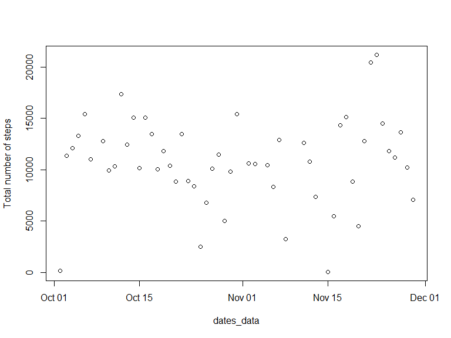
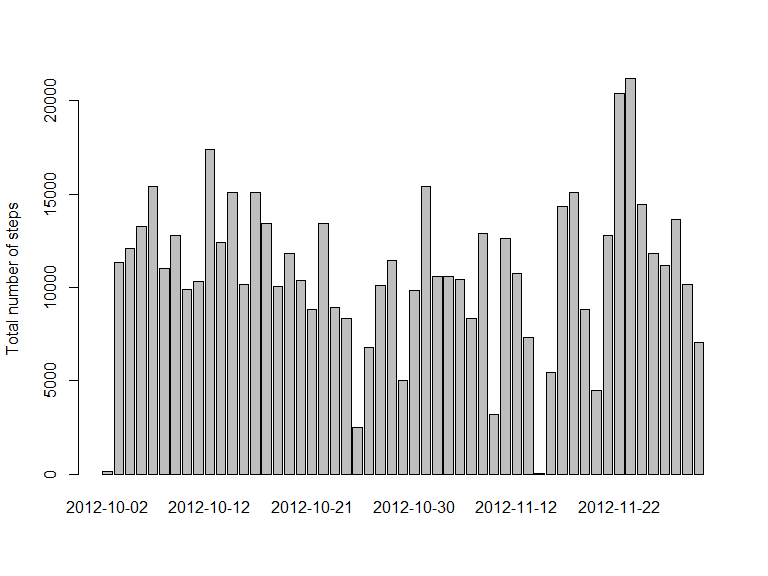
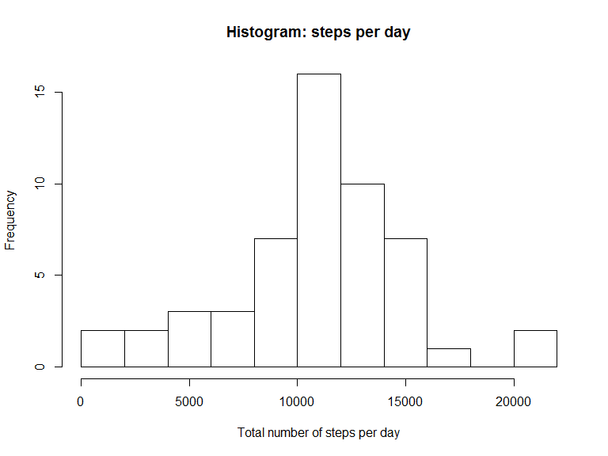
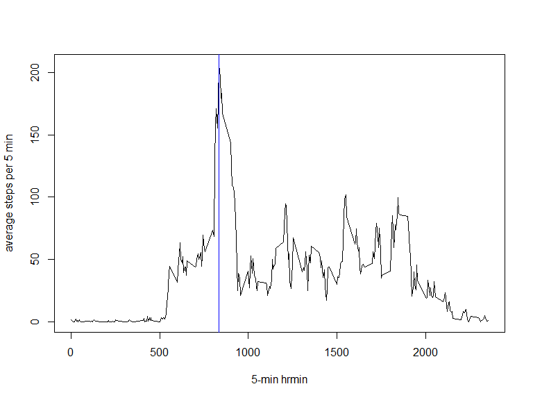
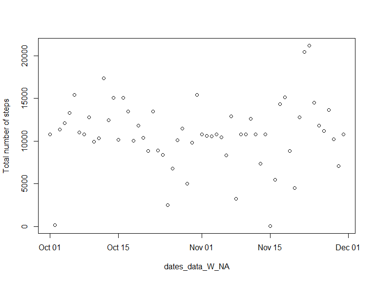
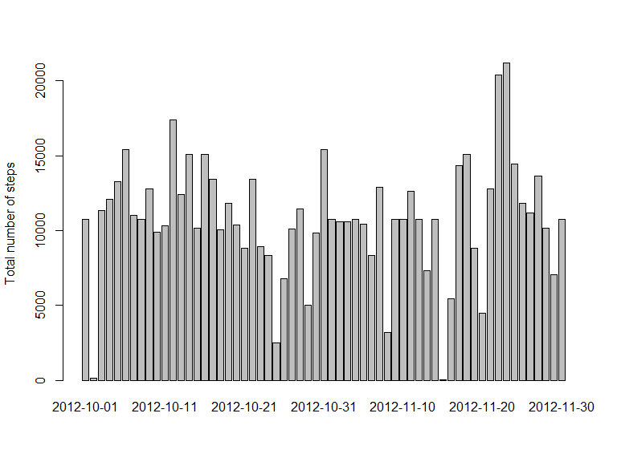
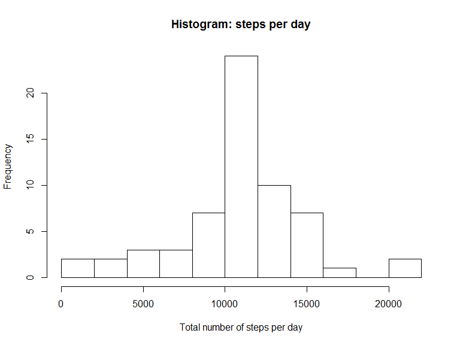
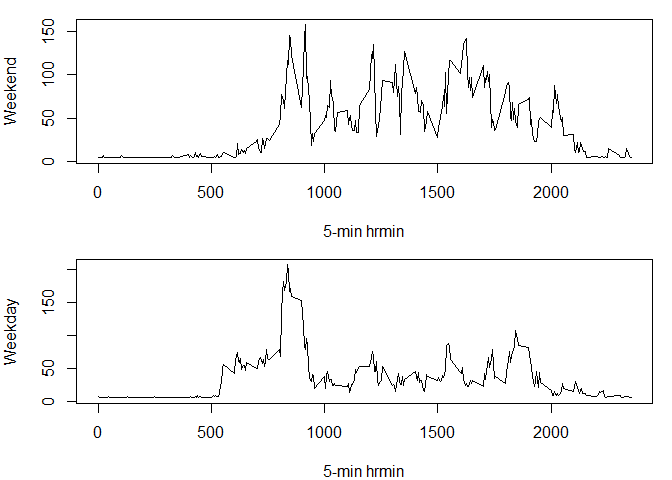

Projetc 1 Markdown

###Loading and preprocessing the data

```r
Activity_data<-read.csv("activity.csv",stringsAsFactors = FALSE)
Activity_data$date<-as.Date(Activity_data$date, "%Y-%m-%d")
```

###What is mean total number of steps taken per day?

```r
Activity_data_clean<-Activity_data[!is.na(Activity_data$steps),]
step_per_day<-tapply(Activity_data_clean$steps,Activity_data_clean$date,sum)

#step<-data.frame(sum=tapply(Activity_data_clean$steps,Activity_data_clean$date,sum))
step_per_day
```

```
## 2012-10-02 2012-10-03 2012-10-04 2012-10-05 2012-10-06 2012-10-07 
##        126      11352      12116      13294      15420      11015 
## 2012-10-09 2012-10-10 2012-10-11 2012-10-12 2012-10-13 2012-10-14 
##      12811       9900      10304      17382      12426      15098 
## 2012-10-15 2012-10-16 2012-10-17 2012-10-18 2012-10-19 2012-10-20 
##      10139      15084      13452      10056      11829      10395 
## 2012-10-21 2012-10-22 2012-10-23 2012-10-24 2012-10-25 2012-10-26 
##       8821      13460       8918       8355       2492       6778 
## 2012-10-27 2012-10-28 2012-10-29 2012-10-30 2012-10-31 2012-11-02 
##      10119      11458       5018       9819      15414      10600 
## 2012-11-03 2012-11-05 2012-11-06 2012-11-07 2012-11-08 2012-11-11 
##      10571      10439       8334      12883       3219      12608 
## 2012-11-12 2012-11-13 2012-11-15 2012-11-16 2012-11-17 2012-11-18 
##      10765       7336         41       5441      14339      15110 
## 2012-11-19 2012-11-20 2012-11-21 2012-11-22 2012-11-23 2012-11-24 
##       8841       4472      12787      20427      21194      14478 
## 2012-11-25 2012-11-26 2012-11-27 2012-11-28 2012-11-29 
##      11834      11162      13646      10183       7047
```


```r
dates_data<-as.Date(levels(factor(Activity_data_clean$date)), "%Y-%m-%d")
plot(dates_data,step_per_day, ylab = "Total number of steps")
```

\

```r
barplot(step_per_day, ylab = "Total number of steps")
```

\

```r
hist(step_per_day, breaks = 10 , xlab = "Total number of steps per day",main="Histogram: steps per day")
```

\

```r
summary(step_per_day)
```

```
##    Min. 1st Qu.  Median    Mean 3rd Qu.    Max. 
##      41    8841   10760   10770   13290   21190
```


###What is the average daily activity pattern? 

```r
step_mean_5min<-tapply(Activity_data_clean$steps,Activity_data_clean$interval,mean)
time_5min<-levels(factor(Activity_data_clean$interval))
plot.ts(time_5min,step_mean_5min,type = "l",ylab="average steps per 5 min", xlab="5-min hrmin")

# to show the 5-min that has the highest average steps
max_step_mean_5min<-max(step_mean_5min)
Time_step_5min<-names(step_mean_5min[step_mean_5min==max(step_mean_5min)])
abline(v=as.numeric(Time_step_5min), col="blue")
```

\


###Imputing missing values

```r
summary(Activity_data)
```

```
##      steps             date               interval     
##  Min.   :  0.00   Min.   :2012-10-01   Min.   :   0.0  
##  1st Qu.:  0.00   1st Qu.:2012-10-16   1st Qu.: 588.8  
##  Median :  0.00   Median :2012-10-31   Median :1177.5  
##  Mean   : 37.38   Mean   :2012-10-31   Mean   :1177.5  
##  3rd Qu.: 12.00   3rd Qu.:2012-11-15   3rd Qu.:1766.2  
##  Max.   :806.00   Max.   :2012-11-30   Max.   :2355.0  
##  NA's   :2304
```

```r
mean(is.na(Activity_data))
```

```
## [1] 0.04371585
```

```r
sum((is.na(Activity_data))==TRUE)
```

```
## [1] 2304
```

```r
step_mean_day<-tapply(Activity_data_clean$steps,Activity_data_clean$date,mean)
step_mean_day_w_NA<-tapply(Activity_data$steps,Activity_data$date,mean)
## There are some days are completely missing so maybe it's better to replace them with average over all
step_mean_day_w_NA[is.na(step_mean_day_w_NA)]<-mean(step_mean_day)
## Now we replace the missing data with the average day which is in step_mean_day_w_NA 
Activity_data_W_NA<-Activity_data
Activity_data_W_NA$steps[is.na(Activity_data_W_NA$steps)]<-step_mean_day_w_NA[as.character(Activity_data_W_NA$date[is.na(Activity_data_W_NA$steps)])]

dates_data_W_NA<-as.Date(levels(factor(Activity_data_W_NA$date)), "%Y-%m-%d")

step_per_day_W_NA<-tapply(Activity_data_W_NA$steps,Activity_data_W_NA$date,sum)

#png("plot4.png", width=480, height=480)
plot(dates_data_W_NA,step_per_day_W_NA, ylab = "Total number of steps")
```

\

```r
barplot(step_per_day_W_NA, ylab = "Total number of steps")
```

\

```r
hist(step_per_day_W_NA, breaks = 10 , xlab = "Total number of steps per day",main="Histogram: steps per day")
```

\

```r
#dev.off()

summary(step_per_day_W_NA)
```

```
##    Min. 1st Qu.  Median    Mean 3rd Qu.    Max. 
##      41    9819   10770   10770   12810   21190
```


Imputing missing values deosn't change the min, mean, and max but it changes the median

###Are there differences in activity patterns between weekdays and weekends?

```r
dates_data_W_NA_weekD<-Activity_data_W_NA[weekdays(Activity_data_W_NA$date)!="Saturday"|weekdays(Activity_data_W_NA$date)!="Sunday",]
dates_data_W_NA_weekD1<-subset(Activity_data_W_NA,weekdays(Activity_data_W_NA$date)!="Saturday"|weekdays(Activity_data_W_NA$date)!="Sunday")
Activity_data_W_NA$day<-as.factor(weekdays(Activity_data_W_NA$date))

Activity_data_weekday<-Activity_data_W_NA[(Activity_data_W_NA$day!="Saturday"&Activity_data_W_NA$day!="Sunday"),]

step_mean_5min_weekday<-tapply(Activity_data_weekday$steps,Activity_data_weekday$interval,mean)
time_5min_weekday<-levels(factor(Activity_data_weekday$interval))

Activity_data_weeked<-Activity_data_W_NA[(Activity_data_W_NA$day=="Saturday"|Activity_data_W_NA$day=="Sunday"),]

step_mean_5min_weeked<-tapply(Activity_data_weeked$steps,Activity_data_weeked$interval,mean)
time_5min_weeked<-levels(factor(Activity_data_weeked$interval))

par(mfrow=c(2,1),mar=c(4,4,1,1))
plot.ts(time_5min_weeked,step_mean_5min_weeked,type = "l",ylab="Weekend", xlab="5-min hrmin")
plot.ts(time_5min_weekday,step_mean_5min_weekday,type = "l",ylab="Weekday", xlab="5-min hrmin")
```

\
